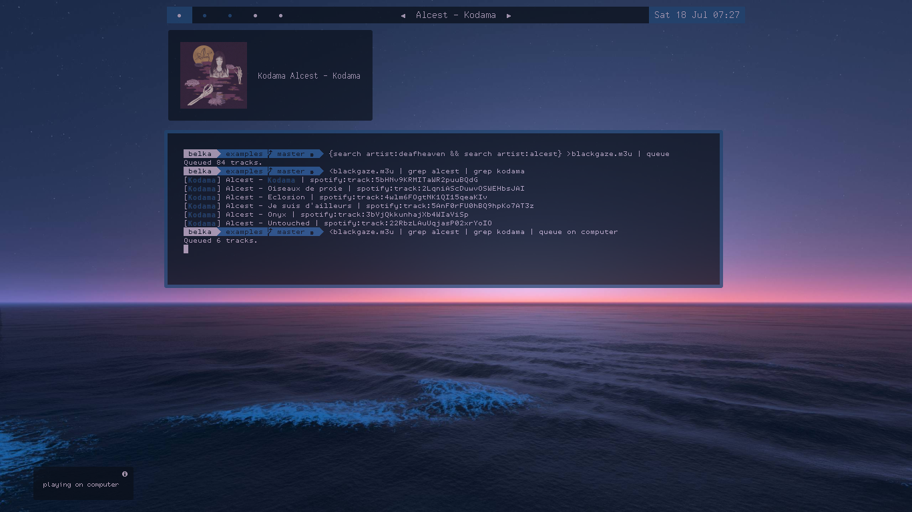

## Spotify-Headless
CLI tool using [puppeteer](https://github.com/puppeteer/puppeteer) to intercept your OAuth-validated Spotify token (alongside of the session cookies), then reinject them to imitate an authorized, User-like traffic.
#### How it works
1. Establish a secure session by authenticating to Spotify within a headless browser. (Puppeteer)<br><del>2. Generate a valid Json Web Token and use it until expiration.</del> <br> <del>3. Start over.</strike> <br>
2. Export the session cookies and store them locally, specifically the refresh token that continually validate the access token throughout its lifespan.
3. The access token allows you to perform special actions on behalf of a user, once expired, it's updated by the refresh token.
4. The first two steps must be repeated once the refresh token expires. (after one year).

#### Installation and configuration
```bash
git clone https://github.com/BelkaDev/Spotify-JWT ~/Spotify-JWT
cd ~/Spotify-JWT && npm i
```
To provide your credentials you need to set them as environement variables within your .bashrc (accordingly any shell config file) <br>
``` bash
export SPOTIFY_USER=""
export SPOTIFY_PWD=""
```
#### Running
Manually grab your access token: <br>
`node token.js` <br>
More examples are included to showcase the extent of the application (searching, controlling playback, transfering streams..) </br>
See below for practical uses.

#### Use case
##### Data scraping 

##### Script automation 
###### aka the sole puporse of the project, it offers an immense flexibility especially when combining aliases
###### <u> example 1  </u>: create a local playlist, filter it, feed stdout to queue:

###### <u> example 2 </u>: set a timer, shuffle songs then transfer ongoing stream to your mobile device:


