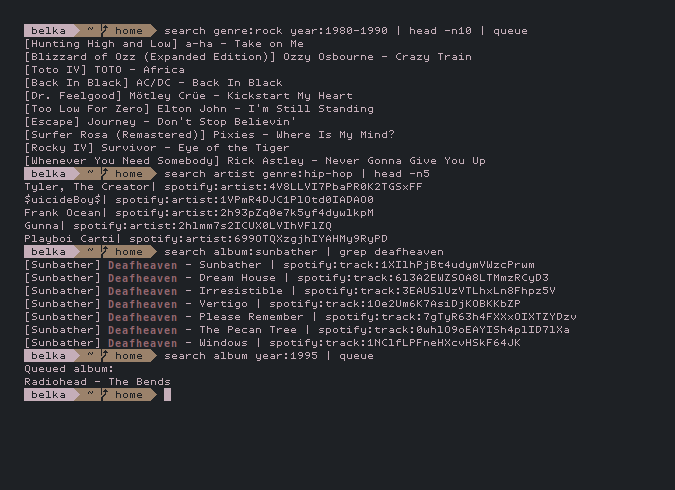
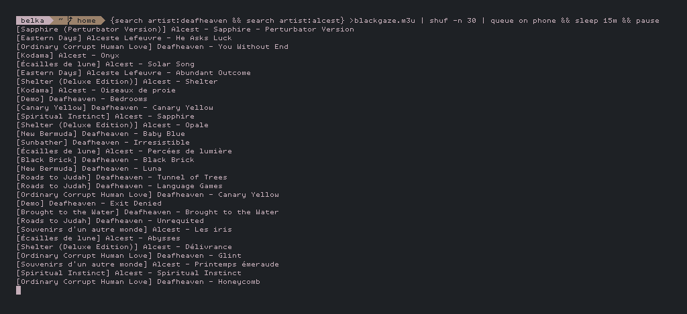
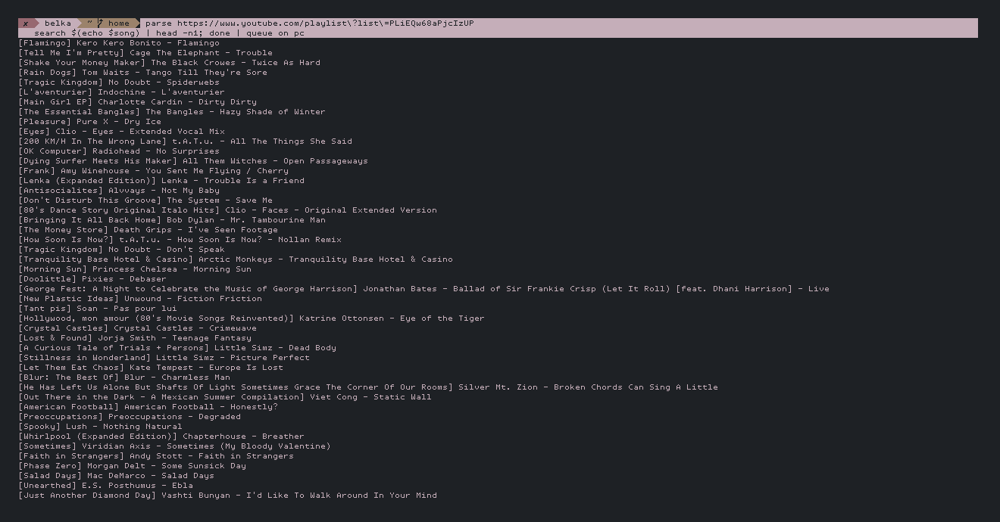

## Spotify-Headless
A CLI tool using [puppeteer](https://github.com/puppeteer/puppeteer) to intercept your own validated spotify OAuth token alongside of the session cookies, then reinject them to mimic an authorized, user-like traffic.
#### How it works
1. Establish a session by authenticating to Spotify within a headless browser. (Puppeteer)
2. Export the session cookies and store them locally, specifically the refresh token that will refresh the JWT every time it expires. (valid for one year)
3. The access token allows you to perform special actions on behalf of a user.

#### Installation and configuration
```bash
git clone https://github.com/BelkaDev/Spotify-Headless ~/Spotify-Headless
cd ~/Spotify-Headless && npm install
```
To provide your credentials you need to set them as environement variables within your bashrc (or your default shell rc) <br>
``` bash
export SPOTIFY_USER=""
export SPOTIFY_PWD=""
```
#### Running
Manually grab your access token: `node token.js` <br>
Other commands are found under `/lib` folder, they are examples of commands from the API with extra features (search, play/resume etc..)

#### Use case
The sole purpose is to combine aliases into automated and complex tasks, this can offer a lot of flexibility as shown below:
###### <u> example 1 (Basic):  </u>: Browse Spotify catalog, filter items, feed STDOUT to queue.

###### <u> example 2 (Advanced) </u>: Store to a local playlist, shuffle songs, set a timer, transfer ongoing stream to your mobile device.

###### <u> example 3 (Expert):  </u>: Convert Youtube playlist to a Spotify playlist.



#### Notes:
* `play.js` reads input from stdin only, it works in pair with the search command.
* `transfer.js` takes `phone/mobile`,`computer/pc`,`browser` as parameters, if the suggested device isn't opened, it sends the signal to the actual active device.
* `search.js` will lookup for tracks by default, unlike other items (albums,playlists etc..), tracks can be stacked and enqueued at once, more details [here](https://developer.spotify.com/documentation/web-api/reference/player/start-a-users-playback/). It takes `album`,`artist`,`playlist` as arguments.
* snippets used in the examples can be found [here](https://github.com/BelkaDev/dotfiles/blob/master/.zshrc)
 
#### Todo:
* Allow creating online playlists.
* Refactor/clean code
* <strike> Catch random/annoying error messages. </strike>
